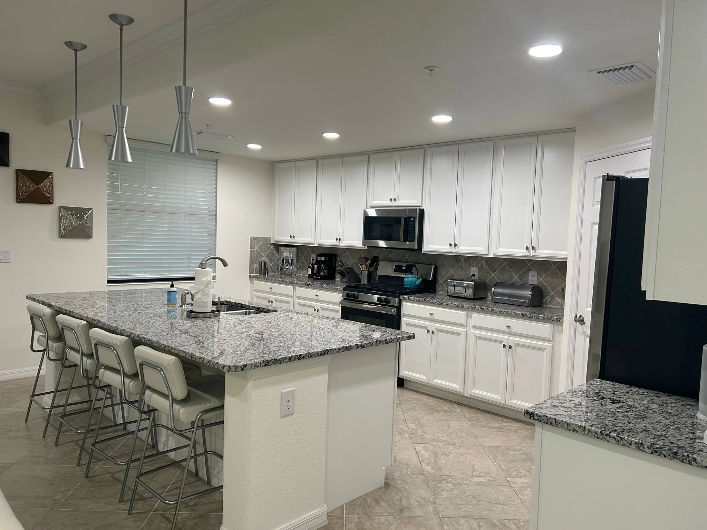
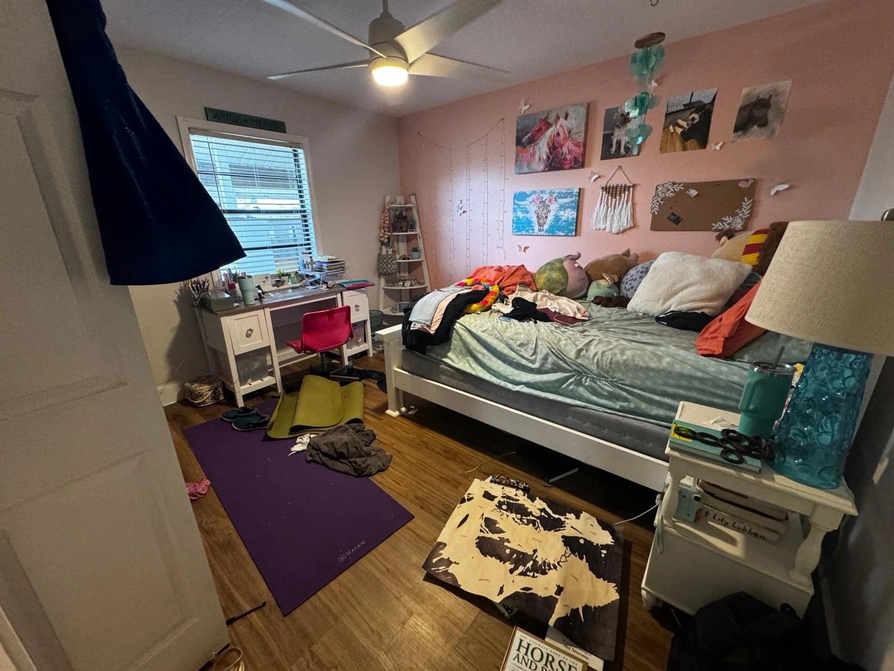
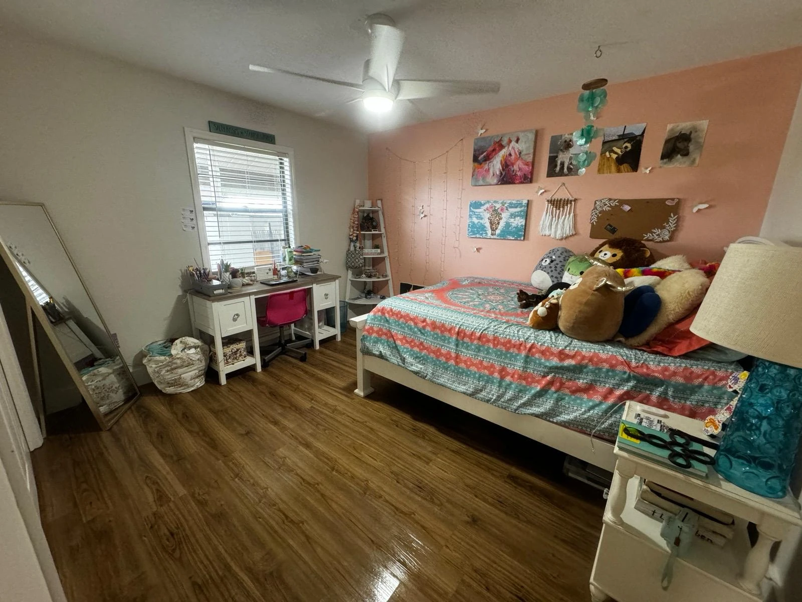

<div align="center">
  

  <h1>Snap Shine Clean</h1>
  <p><strong>Fast, detailed cleaning. More time for what matters.</strong></p>
  <p>Site institucional de limpeza residencial e comercial em Bradenton, Flórida.</p>

  <p>
    <a href="https://snapshine.escolats.com.br/">Ambiente de teste</a> ·
    <a href="https://snapshine.escolats.com.br/#results">Antes e depois</a> ·
    <a href="AMBIENTE-DE-TESTE.md">Publicação</a>
  </p>
  <p><strong>HTML · CSS · JavaScript · GSAP · WebP</strong><br>Sem framework. Sem etapa de build.</p>
</div>

---

## O projeto

Uma experiência voltada a apresentar os serviços, mostrar resultados reais e facilitar o contato por telefone, SMS ou solicitação de orçamento. O conteúdo do site está em inglês americano; esta documentação está em português.



| Experiência | Implementação |
| --- | --- |
| Página inicial | Apresentação, serviços, portfólio, depoimentos, diferenciais e contato. |
| Portfólio real | Quatro pares de antes e depois, quadro proporcional e miniaturas sem cortes. |
| Navegação mobile | Menu compacto, carrossel de fotos e barra de contato fixa. |
| Blog | Os 9 artigos do site antigo, em páginas estáticas com sumário, SEO completo (meta tags, Open Graph, JSON-LD) e artigos relacionados. |
| Movimento | GSAP/ScrollTrigger e respeito à preferência por movimento reduzido. |
| Ambiente de teste | Configuração Apache/LiteSpeed, `noindex`, cache desativado e formulário bloqueado. |

## Executar localmente

Clone o repositório:

```sh
git clone https://github.com/PedroAgostini/SNAP-SHINE.git
cd SNAP-SHINE
```

Com Node.js instalado, inicie a prévia local (sem instalar dependências):

```sh
node servir-local.cjs
```

Acesse **http://127.0.0.1:4173/**, **http://127.0.0.1:4173/blog** ou um artigo, como **http://127.0.0.1:4173/blog/post-construction-cleaning-bradenton**. O servidor local reproduz as URLs sem extensão e os redirecionamentos das páginas antigas. Fontes do Google, GSAP, imagens de banco ainda presentes e o mapa dependem de conexão com a internet.

Na hospedagem Apache/LiteSpeed, o `.htaccess` atende `/blog` e `/clear-cache` usando os arquivos HTML internamente. `/index.html` redireciona para `/`, e `/blog.html` redireciona para `/blog`, preservando parâmetros da URL. Cada artigo fica em `artigos/<slug>.html` e é servido em `/blog/<slug>`; os endereços antigos do WordPress (`/<slug>/`) redirecionam com 301 para o novo endereço. Servidores estáticos genéricos que ignoram `.htaccess` precisam de configuração equivalente.

## Estrutura

```text
SNAP-SHINE/
├── index.html                    # Página inicial
├── blog.html                     # Listagem do blog (cards estáticos)
├── artigos/                      # Um HTML por artigo, servido em /blog/<slug>
├── assets/
│   ├── css/                      # Estilos do site e utilitário de cache
│   ├── js/                       # Interações, formulário e blog
│   ├── icons/                    # Os três SVGs externos usados no site
│   ├── img/                      # Logos e ícone do manifesto
│   ├── imagens-blog/             # Imagem de capa de cada artigo (WebP)
│   └── imagens-selecionadas/
│       ├── ambientes/            # Quatro fotos reais em WebP
│       └── antes-e-depois/        # Oito fotos: quatro comparações
├── .well-known/security.txt
├── .htaccess
├── robots.txt / sitemap.xml
├── llms.txt / llms-full.txt
├── humans.txt / site.webmanifest
├── clear-cache.html
├── antispam.php                   # Biblioteca para integração futura
├── preparar-teste.ps1             # Geração do pacote de publicação
├── servir-local.cjs               # Prévia local com URLs sem extensão
└── AMBIENTE-DE-TESTE.md            # Configuração e conferência no servidor
```

## Fotos e antes/depois

**Somente as 12 fotos utilizadas pelo site estão versionadas.** Os originais JPG/HEIC, vídeos, fotos substituídas, galeria interna de curadoria, capturas de revisão e ZIPs permanecem locais, fora do Git. O `.gitignore` usa uma lista explícita de arquivos permitidos.

| Antes | Depois |
| :---: | :---: |
|  |  |

Os pares atuais têm diferenças de posição da câmera e usam **divisão fixa, sem arraste**, preservando o divisor original em formato de rodo. As fotos são exibidas sem filtros que alterem o resultado da limpeza.

Para trocar um par, edite a miniatura correspondente em `index.html`:

| Atributo | Finalidade |
| --- | --- |
| `data-before` / `data-after` | Caminhos das fotos reais em WebP. |
| `data-width` / `data-height` | Dimensões das imagens, usadas para calcular a proporção. |
| `data-room` | Nome do ambiente usado nos textos alternativos. |
| `data-comparison="fixed"` | Mantém a comparação parada. Use `draggable` somente para um par alinhado. |

Atualize também o `src` da miniatura, suas dimensões e a lista de arquivos permitidos no `.gitignore`. Antes de publicar, confira se todas as fotos novas estão no commit.

## Publicar no ambiente de teste

No PowerShell, execute a partir da pasta do projeto:

```powershell
./preparar-teste.ps1
```

O script gera `snapshine-teste.zip` com os arquivos públicos e os recursos locais referenciados pelas páginas, incluindo as fotos dos atributos `data-before` e `data-after`. Ele não precisa das pastas privadas de curadoria e pode ser executado após um clone limpo.

Extraia o conteúdo do ZIP na raiz do subdomínio **snapshine.escolats.com.br**, preservando `.htaccess` e `.well-known/`. A hospedagem deve ter HTTPS e Apache 2.4 ou LiteSpeed compatível. Consulte [as instruções completas de publicação](AMBIENTE-DE-TESTE.md).

## Estado desta versão

> **Ambiente de teste:** o envio de orçamento está desativado. O site contém `noindex` e não deve ser usado em produção sem revisar a configuração.

- O formulário permite navegar pelas etapas, mas não envia mensagens. `antispam.php` é uma biblioteca auxiliar, não um endpoint ativo.
- O blog traz os 9 artigos publicados em snapshineclean.com, com o texto original e as imagens originais de capa.
- Algumas imagens ilustrativas de banco continuam em serviços e no CTA do blog. As fotos do portfólio são reais.
- A interface foi conferida em Chromium e WebKit, incluindo telas de 320 a 1440 px. A aplicação do `.htaccess` e a execução de PHP precisam ser conferidas na hospedagem.

## Créditos

**Snap Shine Clean** · Desenvolvimento por [Eu Sou TS](https://eusouts.com.br/).

Fotografias reais fornecidas pelo cliente; imagens ilustrativas remanescentes via Unsplash. Este repositório não concede licença de reutilização da marca ou das fotografias.
